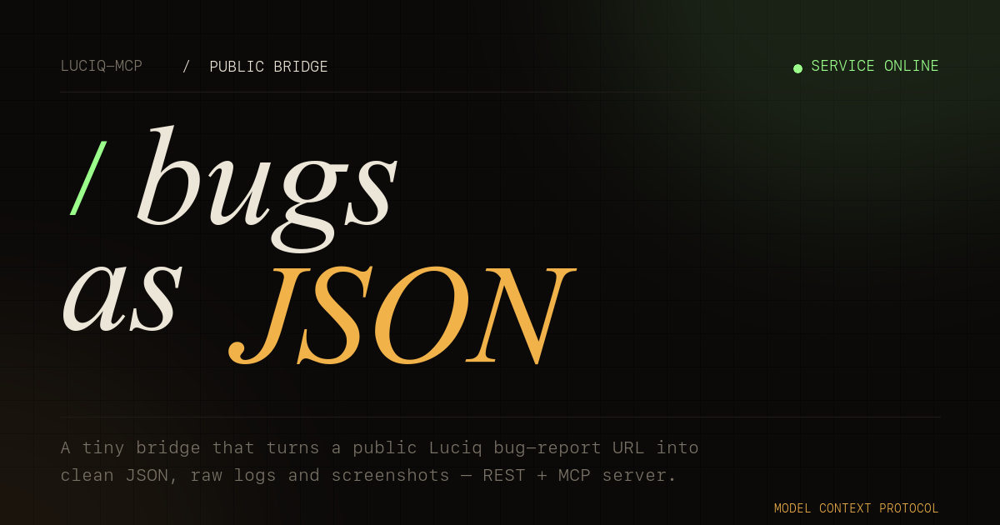

# luciq-instabug-mcp



Fetch logs and screenshot from a public **Luciq** (formerly Instabug) bug
report URL like `https://dashboard.luciq.ai/bugs/<token>`.

The public API requires no auth. Logs and the screenshot live on signed
CloudFront URLs that expire ~3 weeks after metadata is fetched, so download
them promptly.

Same data exposed two ways: a flat REST API and a Model Context Protocol
server (stdio + streamable-HTTP). Written in TypeScript, deployable to **Docker**, **Vercel** and **Cloudflare Pages** from the same source.

## Install in Claude Code CLI

The fastest path — clone, build, register the stdio transport in user scope:

```bash
make install && make build
make mcp-add-stdio   # claude mcp add --scope user luciq -- node $PWD/dist/src/bin/mcp-stdio.js
make mcp-list        # → luciq: ... ✓ Connected
```

No daemon, no port — Claude Code spawns the Node process on demand.

Need an HTTP transport (Docker, remote, multi-client)? See
[Quickstart (Docker locale)](#quickstart-docker-locale) and use `make mcp-add`.

Manual equivalents:

```bash
# Node stdio (absolute path to the built entrypoint in this repo)
claude mcp add --scope user luciq -- node ~/luciq-instabug-mcp/dist/src/bin/mcp-stdio.js

# Docker, MODE=local (streamable-HTTP on :8080)
claude mcp add --transport http --scope user luciq http://localhost:8080/mcp

# Docker, MODE=proxy (Traefik reverse proxy on :80)
claude mcp add --transport http --scope user luciq http://luciq.mcp.localhost/mcp
```

`--scope user` makes it available from any project; use `--scope project` to
limit it to the current repo.

## Quickstart (Docker locale)

Requires Docker and the [Claude Code CLI](https://docs.claude.com/claude-code).
Pick a **deploy mode** with `MODE=`:

| MODE | URL | Setup |
|---|---|---|
| `local` *(default)* | `http://localhost:8080/mcp` | publishes the host port `8080:8080` |
| `proxy` | `http://luciq.mcp.localhost/mcp` | joins the external `reverse-proxy` network with Traefik labels |

One-shot bootstrap (build + start + register in Claude CLI + verify):

```bash
make start-stack              # MODE=local (default)
# or
make start-stack MODE=proxy   # behind a Traefik reverse proxy on :80
```

Or step by step:

```bash
make up MODE=local      # build + run in the chosen mode
make health             # /mcp → 405 by design, /healthz → 200
make mcp-add            # registers the right URL for the current MODE
make mcp-list           # → luciq: ... ✓ Connected
```

Modes are implemented as compose overrides:
[docker-compose.yml](docker-compose.yml) is the base,
[docker-compose.local.yml](docker-compose.local.yml) and
[docker-compose.proxy.yml](docker-compose.proxy.yml) only carry the diff.
Tear down with `make down` (use the same `MODE=` you started with).

Run `make help` for the full target list.

## Quickstart (Node locale, no Docker)

Requires Node 20+.

```bash
make install            # npm install
make dev                # tsx watch — hot-reload on src/ changes
# or
make build && make start
```

Defaults: server on `http://0.0.0.0:8080`, MCP at `/mcp`.
Override with `PORT`, `HOST`, `LOG_LEVEL`, `CORS_ORIGINS`.

For the one-shot CLI download:

```bash
npx tsx src/cli.ts https://dashboard.luciq.ai/bugs/<token>
# → ./bug-<number>/{bug.json, logs/*.json, screenshot.jpg}
```

Options: `-o OUT`, `--no-screenshot`, `--logs instabug_log,network_log`, `--quiet`.

## Deploy on Vercel

```bash
make vercel-deploy      # npx vercel deploy --prod
```

[vercel.json](vercel.json) rewrites every request to the catch-all function
[api/index.ts](api/index.ts), which delegates to the shared Hono app.
Local preview: `make vercel-dev`.

## Deploy on Cloudflare Pages

```bash
make cf-deploy          # npx wrangler pages deploy .
```

[wrangler.toml](wrangler.toml) enables `nodejs_compat`. The
[functions/[[path]].ts](functions/%5B%5Bpath%5D%5D.ts) catch-all forwards
every request to the same Hono app.
Local preview: `make cf-dev`.

## Layout

```
src/
  client.ts        # Luciq HTTP client (runtime-agnostic, fetch-based)
  tools.ts         # MCP tool registry — shared between stdio and HTTP
  mcp-http.ts      # Stateless MCP-over-HTTP handler (no SDK; works on Workers)
  app.ts           # Hono app: REST + /mcp + landing + healthz + favicon
  assets.ts        # index.html + favicon.svg inlined
  cli.ts           # one-shot CLI (port of luciq_fetch.py)
  bin/serve.ts     # Node HTTP entrypoint (Docker default + npm start)
  bin/mcp-stdio.ts # MCP stdio entrypoint (Claude Desktop)

api/index.ts                # Vercel function entrypoint
functions/[[path]].ts       # Cloudflare Pages function entrypoint

vercel.json                 # Vercel rewrites
wrangler.toml               # Cloudflare Pages config
Dockerfile                  # multi-stage Node 22 alpine build
docker-compose.yml          # base service + healthcheck
docker-compose.local.yml    # MODE=local: publish :8080
docker-compose.proxy.yml    # MODE=proxy: join Traefik network
Makefile                    # install / dev / build / Docker / Vercel / CF
```

## MCP server (for AI agents)

Same six tools, two transports. Pick the right one for your agent.

### Tools exposed

| Tool | Purpose |
|---|---|
| `list_log_types()` | enumerate the log-type names |
| `get_bug(token)` | metadata + asset list (no log bodies) |
| `get_device_info(token)` | OS, device, app version, locale, … |
| `get_log(token, log_type)` | a single log type (recommended) |
| `get_all_logs(token)` | every non-empty log merged (heavy) |
| `get_screenshot(token, variant?)` | JPEG returned as MCP `ImageContent` so vision-capable agents can see it. `variant` ∈ `original`, `big_thumb`, `thumb`. |

`token` is either the bare share token or the full
`https://dashboard.luciq.ai/bugs/<token>` URL.

### Use from Claude Desktop / Claude Code (stdio)

```bash
make install && make build
```

`~/.claude/claude_desktop_config.json` (or the project-local equivalent):

```jsonc
{
  "mcpServers": {
    "luciq": {
      "command": "node",
      "args": ["/absolute/path/to/luciq-instabug-mcp/dist/src/bin/mcp-stdio.js"]
    }
  }
}
```

Or via Docker (stdio over `docker run -i`):

```jsonc
{
  "mcpServers": {
    "luciq": {
      "command": "docker",
      "args": ["run","--rm","-i",
               "--entrypoint","node",
               "luciq-instabug-mcp:latest",
               "/app/dist/src/bin/mcp-stdio.js"]
    }
  }
}
```

### Connectivity checks

```bash
curl -i http://localhost:8080/healthz   # → 200 ok
curl -i http://localhost:8080/mcp       # → 405 (stateless, POST only) — by design

# Full handshake
curl -sS -X POST http://localhost:8080/mcp \
  -H 'Content-Type: application/json' \
  -d '{"jsonrpc":"2.0","id":1,"method":"initialize","params":{}}'
```

## REST HTTP service

Once the server is running (locally, in Docker, or on Vercel/Cloudflare),
the same data is reachable via plain REST. Routes (all `GET`):

| Path | Description |
|---|---|
| `/healthz` | liveness probe |
| `/bugs/<token>` | bug metadata + asset list + raw API payload |
| `/bugs/<token>/logs` | every non-empty log merged into one JSON object |
| `/bugs/<token>/logs/<type>` | single log (`user_steps`, `instabug_log`, `network_log`, `sessions_profiler`, …) |
| `/bugs/<token>/screenshot[?variant=original\|big_thumb\|thumb]` | JPEG bytes |
| `/mcp` | streamable-HTTP MCP transport (POST only) |

`<token>` may be the bare token or a URL-encoded full dashboard URL.

## Endpoint reference

`GET https://api.luciq.ai/api/web/public/bugs/<token>` returns a JSON whose
`bug.state.logs.*.url` and `bug.state.attachments.screenshot.original` are
the signed CloudFront URLs we download.

Available log types: `user_steps`, `console_log`, `instabug_log`, `user_data`,
`network_log`, `user_events`, `sessions_profiler`. Logs are JSON arrays of
entries (the client returns parsed JSON when possible, raw text otherwise).

> **Disclaimer** — Unofficial hobby project. Not affiliated with, endorsed by,
> or sponsored by Luciq / Instabug. "Luciq" and "Instabug" are trademarks of
> their respective owners and are used here only to describe the public bug
> report URLs this tool consumes.
